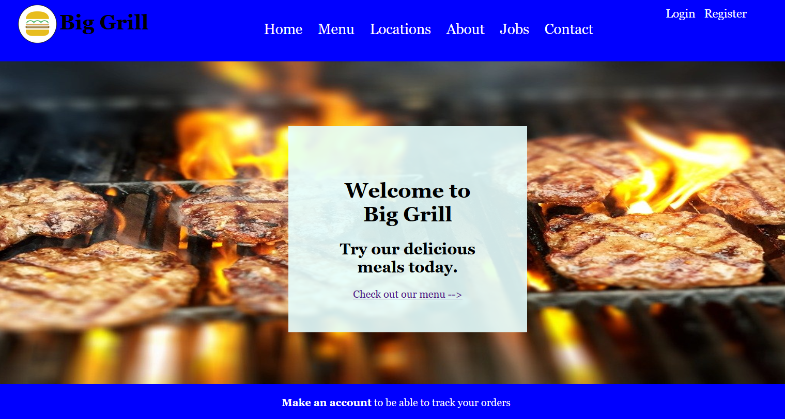
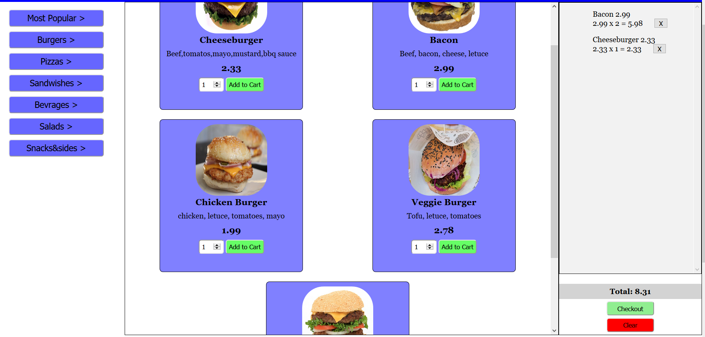
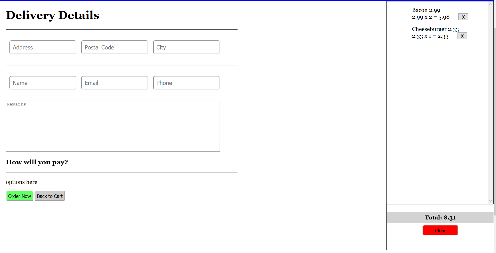
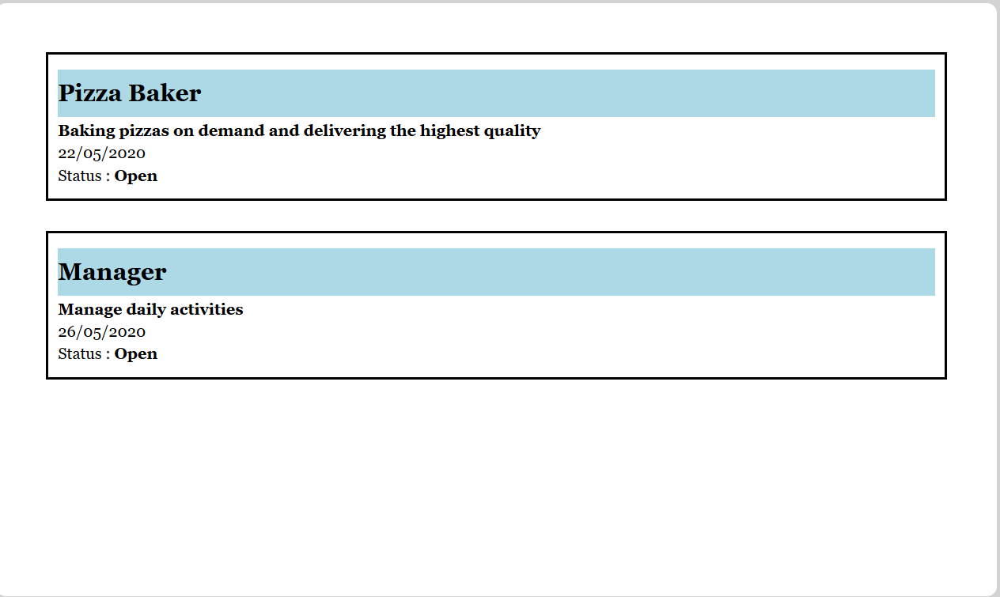
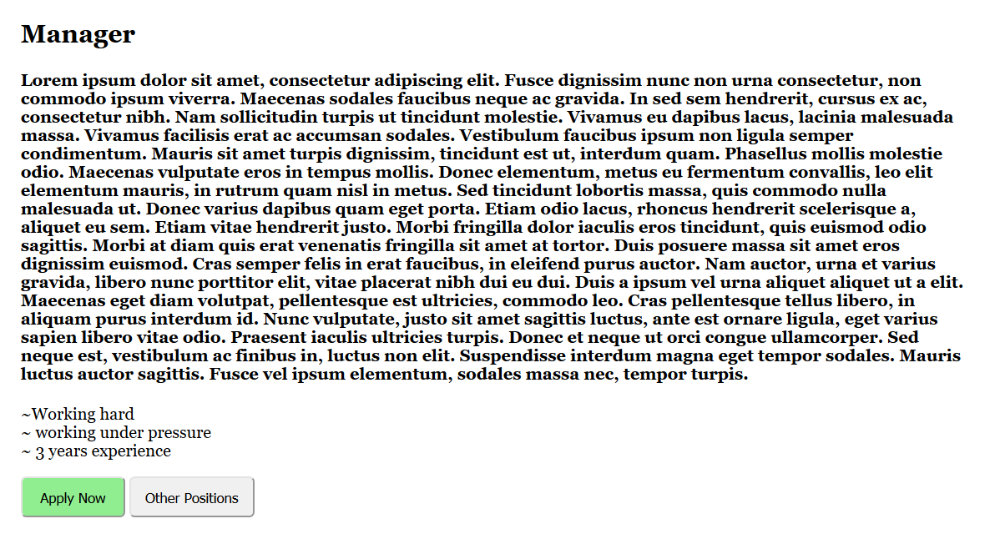
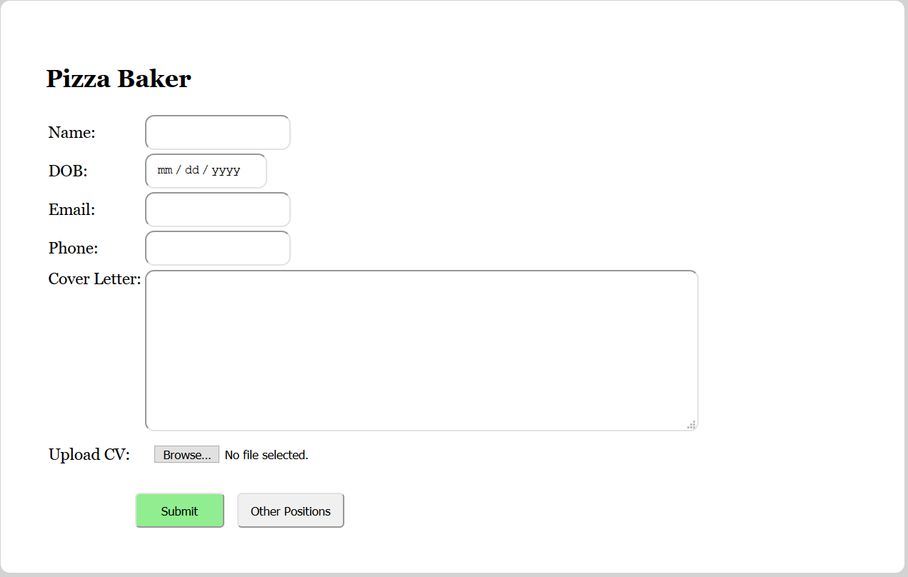
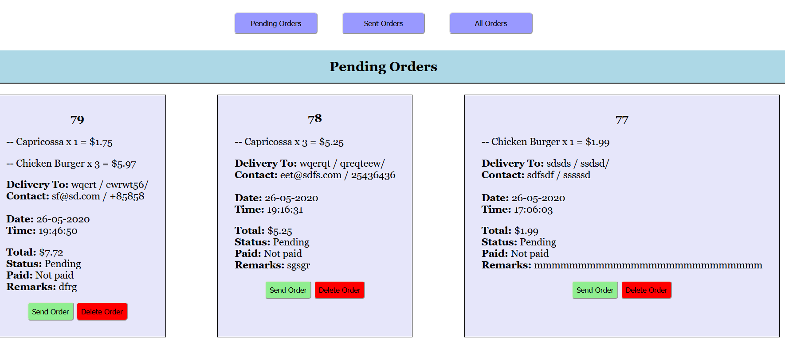
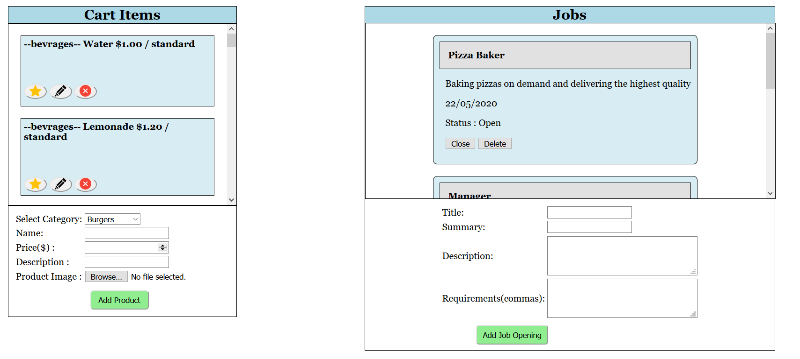
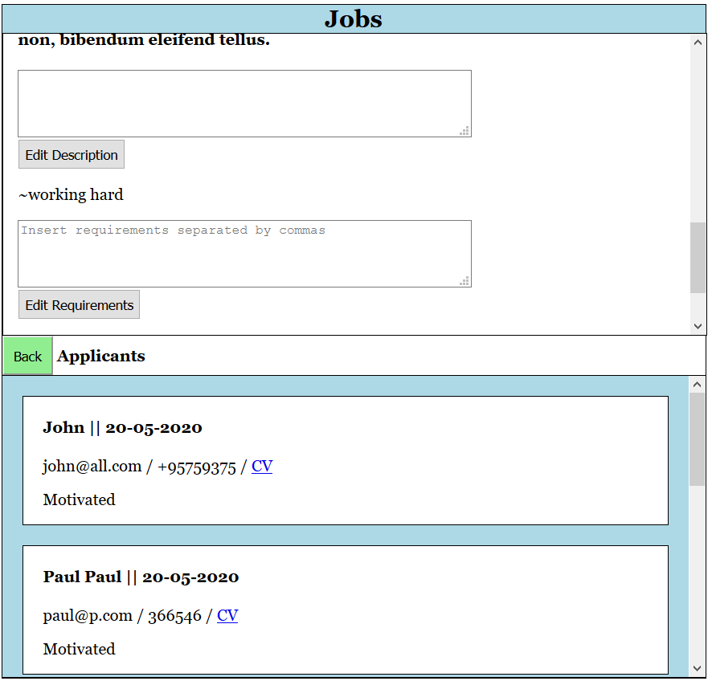
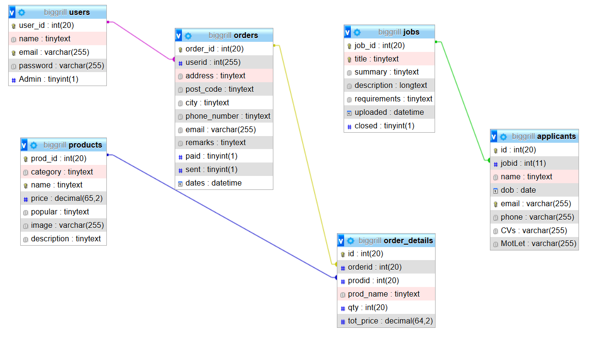

# Big-Grill
## Website for a made-up restaurant, which allows users to order with or without an account.  
  
It allows owners to provide a better service to customers and notify them once their order has been sent. Further options allow
admins( owners) to add/remove/edit menu items. 
Owners can also seek new employees over the website.
They can post a job application as well as keep an eye on who applied. 
  

  
#### This projectuses the following technologies:
 - PHP 7.2
 - JavaScript
 - html/css
  
#### Project Limitations:  
 - Focus was not too drawn on form validation,some basic practices against html and SQL injections are set
 - Some posssible bugs are still present
 - Further improvements on products, features such as a checklist for specific preferences (add ketchup, remove mustard)
 could be added.
 - Payment system/options not integrated.
 - Order tracking notification (sound or visual) which alerts the user when the order is sent.
   
### Users Point of View:   

  
Users can browse products from the restaurant, as wel las add products to cart.
They can interact with the cart (add,delete,clear). If they want to add the same product, they can
and it will be added to the existing product count.

Once they are done they can proceed to checkout in which they can finalize their order and pay. 

  

Furthermore, they can check out available job opportunities offered by the restaurant.  
  
  
  
  
  
  
Selecting a job enlarges it and gives more details such as a detailed description and and a button to apply or browse other jobs.
Once the user clicks the button he is taken to an application div (all loaded with ajax so no refreshing).

### The job application looks as so:  
  

### Admin's Point of View  
administrator has the same view as the user but also additional featurs. This is made os that the owner of the restaurant can
see the users' point of view. Otherwise the owners would probably need to have 2 accounts (1 admin , 1 user).  

The above image show sthe orders page which only admin has. This is to control all order. In hese the Admin can click on "sent" 
for the order to change status to sent, which will show on user profile page if they made an account previously. Even is the user
does not have an acount it is a useful feature for the owners, as they can have an overview of which orders are sent and wchich 
are still pending.

   

Another feature that Admin has is the Edit page. On this page the Admin can add or remove items from the menu. Admin can also 
select or remove items from "popular" category. This category shows as featured on the menu page. It also works in reverse as they can
also remove an item from popular. That way they can keep certain items in front.  
They can fill the form for new product and upload it or use the "pencil" button to change its description.
Lastly the red x button does exactly what it looks like.. deletes the item.

On the other side is the job tab on which the admin can add/ remove/ edit job applications. Image of the full page can be seen below.
  
 
  
Once the admin clicks on a specific job. The jobs is enlarged and it shows 
additional information about the job as well who has applied for the position.
It shows the name,age, contact CV and motivational letter from the applicants.
  
 
  

### Database
Database is structured so that jobs are separated from other tables. This is so that the job 
applications aren't tied to users but to the applicat's CV instead.  
  
    
